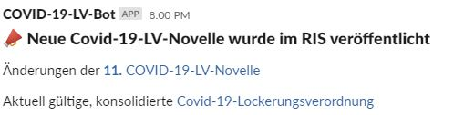

# checkRIS

Simple script that can be run as a cron-job to periodically check the Rechtsinformationssystem des Bundes (RIS) for new Covid-19 LockerungsVOs. If so, it sends the new LockerungsVO to certain e-mail adresses and can also post into Slack-Channels

## Setup

clone it and fill in your credentials for E-Mail and Slack

---

## Slack setup

[create a slack-App](https://api.slack.com/apps?new_app=1) in your workspace and grant it following permissions:

- `channels:read`
- `chat:write`
- `groups:read`
- `chat:write.public`
- `incoming-webook`

copy the *Bot User OAuth Access Token* and set `slack_token` You'll need the `channels:read` and `groups:read` permissions to figure out the Slack-channel Ids (e.g. use the [Web-API](https://api.slack.com/methods/conversations.list) via [Postman](https://www.postman.com/)) Then set the `slack_channel` variables accordingly.

### The Bot in action

---

## E-Mail setup

just fill all the `email_XXXX` variable with the appropriate values and send e-mails around :-)

## cron-job

use f.e crontab:

 `0 */2 * * * $(which python3) /home/user/scripts/checkRIS.py >> /home/user/scripts/ris_cron.log 2>&1`
